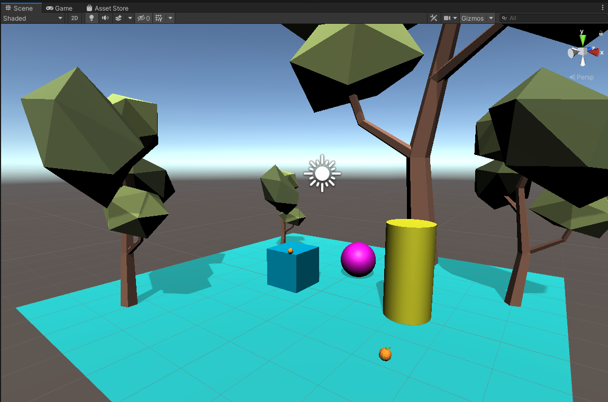

# Getting Started with Unity

Familiarize yourself with the Unity Interface to create a new project, save a scene, and create a 3D composition using basic GameObjects. 

## Goals: 

* Setting up a Unity project
* Importing assets
* Creating and manipulating GameObjects
* Creating and applying materials
* Adding/Importing 3D models
