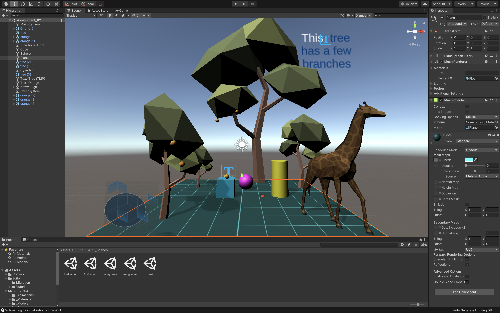

# Adding labels and information to a scene

# Goals: 
* Importing textures and applying them to materials
* Creating materials with transparency
* Importing and using TextMesh Pro
* Adding information to scenes by using TextMesh Pro 
* Adding relevant information to scenes by using images
