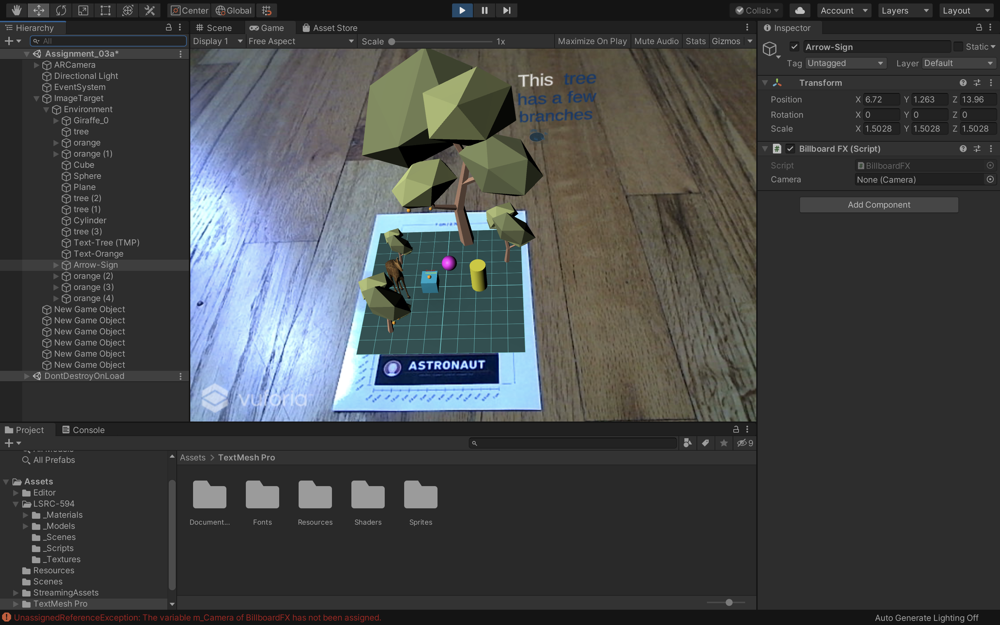

# Adding AR into Unity

## Goals:

> While doing this assignment, your will learn how to implement AR in Unity and to augment your digital content using an image target. You will achieve that by:

* Enabling XR settings in Unity
* Importing the Vuforia Engine
* Using an AR camera
* Setting up Image Targets
* Adding digital content

## About

For this assignment we wil implement AR using the Vuforia Software Development Kit (SDK). The Vuforia SDK is a suite of assets and code snippets that work alonside Unity to make it easier to quickly develop and build AR content for a variety of platforms. A vuforia developer account is needed in order to use the SDK, and to create image targets.
